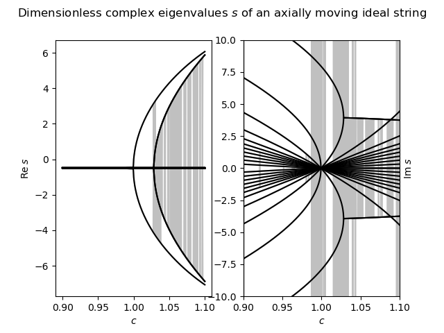

**Figure**. _Orderfix applied to an example problem. Legend: gray = before, black = after_.

# orderfix

Reorder solutions of parametric studies (assumed to be in random order) to make continuous curves.

The common use case is postprocessing of numerically computed eigenvalues from parametric studies of linear PDE boundary-value problems.
The ordering of the numerically computed eigenvalues may suddenly change, as the problem parameter sweeps through the range of interest.

The reordering allows the plotting of continuous curves, which are much more readable visually than scatterplots of disconnected points.

The simple distance-based algorithm implemented here may fail in regions where the solutions cluster closely together,
but for the most part of the data, it usually works well.

For a discussion of this issue and some more algorithms, see Jeronen (2011), On the mechanical stability and out-of-plane dynamics of a travelling panel submerged in axially flowing ideal fluid: a study into paper production in mathematical terms, Jyväskylä Studies in Computing 148, University of Jyväskylä. [ISBN 978-951-39-4596-1](http://urn.fi/URN:ISBN:978-951-39-4596-1)


## Usage summary

Basically:
```python
import orderfix
orderfix.fix_ordering(data)
```

See [`test.py`](test/test.py) for a usage example, complete with test data generation.


## Installation

### From PyPI

Install as user:

```bash
pip install orderfix --user
```

Install as admin:

```bash
sudo pip install orderfix
```

### From GitHub

As user:

```bash
git clone https://github.com/Technologicat/orderfix.git
cd orderfix
python setup.py install --user
```

As admin, change the last command to

```bash
sudo python setup.py install
```


## Dependencies

- [NumPy](http://www.numpy.org)
- [Cython](http://www.cython.org)
- [Matplotlib](http://www.matplotlib.org) (optional, for visualizing test results in `test.py`)


## License

[BSD](LICENSE.md). Copyright 2016-2017 Juha Jeronen and University of Jyväskylä.


#### Acknowledgement

This work was financially supported by the Jenny and Antti Wihuri Foundation.

